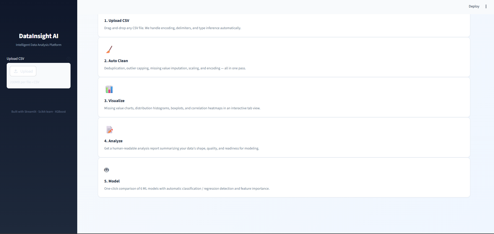
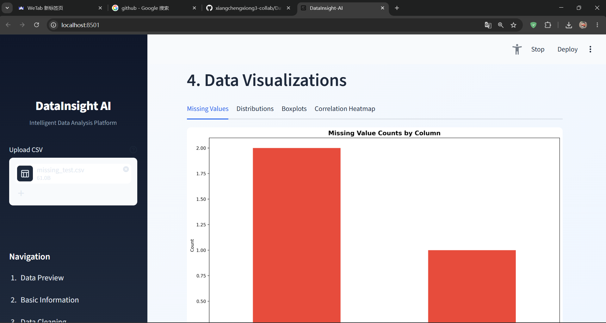
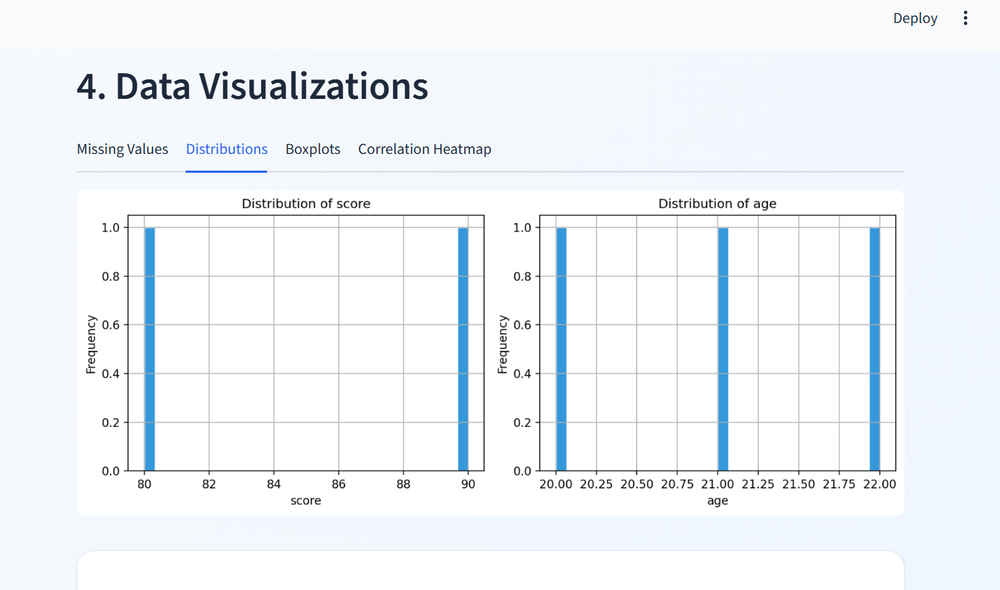
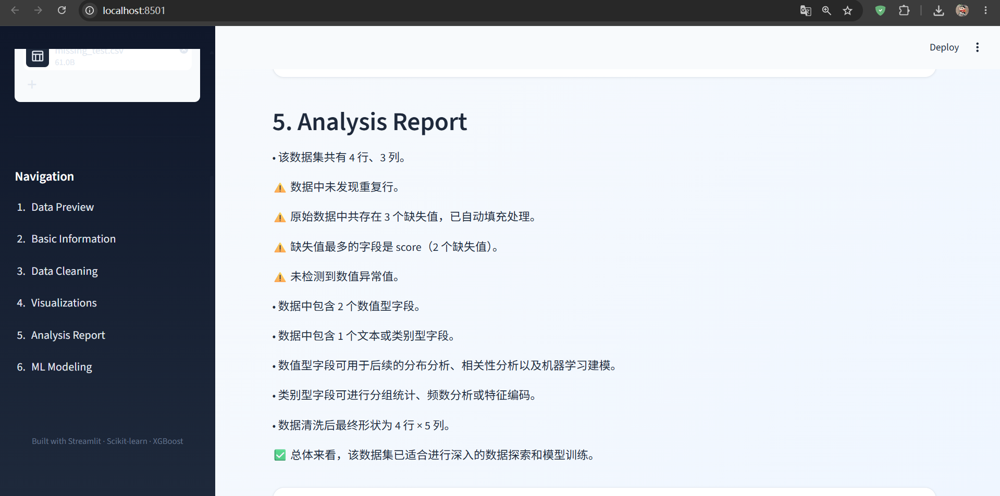
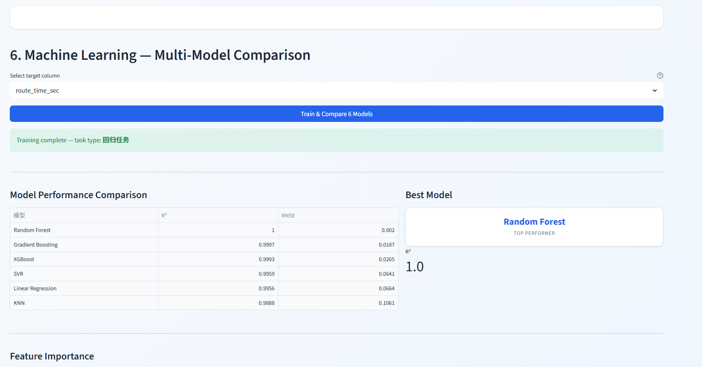

# DataInsight-AI

**Automated data analysis and machine learning web app.**

Upload a CSV file and instantly get: exploratory data analysis, automated data cleaning, rich visualizations, an analysis report, and multi-model ML comparison — all through an intuitive web interface.

## Features

- **Automated EDA** — row/column statistics, missing value analysis, data type detection, outlier detection
- **Smart Data Cleaning** — deduplication, IQR-based outlier handling, missing value imputation, StandardScaler normalization, one-hot encoding
- **Rich Visualizations** — missing value bar charts, multi-field distribution histograms, boxplots, correlation heatmaps
- **Multi-Model Comparison** — 6 models compared head-to-head with evaluation metrics and feature importance
- **Automated Analysis Report** — rule-based textual summaries of data quality, structure, and modeling readiness

## Tech Stack

| Layer            | Technology            |
| ---------------- | --------------------- |
| Web UI           | Streamlit             |
| Data Processing  | Pandas, NumPy         |
| Visualization    | Matplotlib, Seaborn   |
| Machine Learning | Scikit-learn, XGBoost |
| Testing          | Pytest                |

## Screenshots

| Landing Page                   | Missing Values                             |
| ------------------------------ | ------------------------------------------ |
|  |  |

| Distributions                           | Analysis Report            |
| --------------------------------------- | -------------------------- |
|  |  |

| ML Modeling                    |
| ------------------------------ |
|  |

## Architecture

```
CSV Upload
    │
    ▼
data_loader.py          ← Load CSV into DataFrame
    │
    ▼
eda.py                  ← Basic stats, outlier detection, correlation
    │
    ▼
preprocessing.py        ← Auto-clean: deduplicate → outliers → missing → scale → encode
    │
    ├── visualization.py ← Missing values, distributions, boxplots, heatmaps
    ├── report.py        ← Auto-generated text report
    │
    ▼
modeling.py             ← 6-model comparison + feature importance
```

## Quick Start

```bash
# Clone the repository
git clone https://github.com/xiangchengxiong3-collab/DataInsight-AI.git
cd DataInsight-AI

# Create virtual environment
python -m venv .venv
source .venv/bin/activate  # Windows: .venv\Scripts\activate

# Install dependencies
pip install -r requirements.txt

# Run the app
streamlit run app.py
```

Open http://localhost:8501 in your browser.

## Usage

1. Upload a CSV file via the web interface
2. View basic statistics and data types
3. See the automated cleaning results (duplicates removed, outliers handled, etc.)
4. Explore visualizations across 4 tabs
5. Read the auto-generated analysis report
6. Select a target column and run multi-model comparison
7. View the best model and feature importance

## Models

**Classification:** Random Forest, XGBoost, Logistic Regression, SVM, KNN, Gradient Boosting
**Regression:** Random Forest, XGBoost, Linear Regression, SVR, KNN, Gradient Boosting

## Testing

```bash
python -m pytest tests/ -v
```

## License

MIT
